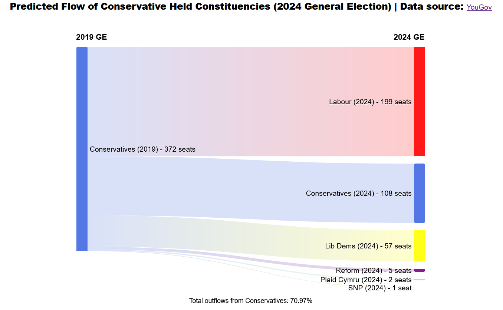

  

# Conservative Constituency Flow Sankey Diagram

A Sankey diagram visualising the predicted flow of Tory-held seats in the 2024 UK general election developed using D3.js.

## Description

The diagram was developed using HTML, CSS, JavaScript, and D3.js. The data was taken from an MRP poll by the polling company YouGov showing projected results by parliamentary constituency for the 2024 general election. When looking through the data, I opted to focus on the flow of Conservative-held seats as there is a huge amount of movement predicted. When researching possible visualisations in D3.js, I decided to go with a Sankey diagram as this highlights the flow of data between nodes which I deemed fit for purpose in this instance.

The graph links the initial node representing the Conservative-held seats in the 2019 general election to various nodes representing predicted seat numbers held by parties. I styled the links with the colours associated with each party, as well as a colour gradient to further visualise the flow. The diagram is also interactive, with a modal specifying the percentage of the predicted seats taken from the Conservatives to each party when the user hovers over each link.

## Deployment

The site is deployed on GitHub pages:

https://jamesrobertsutcliffe.github.io/constituency-flow-sankey-chart/

## Acknowledgments

- https://tableconvert.com/excel-to-json for allowing me to seamlessly convert excel data to a javascript object.
